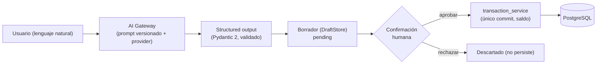

# Plata

**No te dice solamente cuánto dinero tenés. Te dice cuánto podés usar.**

## El problema

Las aplicaciones de finanzas personales muestran el saldo de la cuenta y lo tratan como
si fuera dinero disponible. No lo es. Ese número ignora el alquiler que vence en diez
días, las cuotas que se van a debitar, los servicios y todo lo que ya está comprometido
antes de llegar a fin de mes.

El resultado es una decisión que la persona toma varias veces por día sin información
real: *¿puedo gastar esto o no?* Se termina resolviendo por intuición, y la intuición
falla justo cuando más importa.

## La propuesta de valor

Plata parte del saldo, resta todo lo que ya está comprometido hasta fin de mes y
responde una sola pregunta con un número concreto:

> **Cuánto podés gastar hoy sin comprometer el resto del mes.**

No es un tablero de reportes ni una herramienta de contabilidad. Es una respuesta.

## Funciones centrales del MVP

1. **Disponible real y límite diario.** Calcular el dinero efectivamente disponible
   descontando compromisos futuros, y derivar de ahí cuánto se puede gastar por día.
2. **Registro de gastos en lenguaje natural.** El usuario escribe `café 3500` o
   `super 42 mil` y el gasto queda cargado, interpretado por IA.
3. **Simulación de compras y cuotas.** Antes de comprar, ver cómo esa compra —
   especialmente si es en cuotas — impacta el disponible de los próximos meses.

## Stack

| Capa | Tecnología |
|---|---|
| Lenguaje backend | Python 3.12 |
| API | FastAPI |
| Base de datos | PostgreSQL |
| ORM | SQLAlchemy 2 (tipado `Mapped` / `mapped_column`) |
| Migraciones | Alembic |
| Validación | Pydantic |
| Tests | Pytest |
| Frontend | React + JavaScript + Vite |
| Infraestructura local | Docker Compose (solo PostgreSQL) |

El dinero se maneja con `Decimal` en Python y `Numeric` en PostgreSQL. Nunca con
floats.

## Requisitos previos

| | |
|---|---|
| Python 3.12 | El backend fija esta versión. Verificá con `py -3.12 --version`. |
| Node.js 20+ | Para el frontend. Verificá con `node --version`. |
| Docker Desktop | Corre PostgreSQL. Tiene que estar **iniciado**, no solo instalado. |
| Git | Para clonar. |

Todos los comandos son para **PowerShell en Windows**. Los bloques indican desde qué
carpeta se ejecutan; seguilos en orden y no vas a tener que adivinar dónde estás parado.

## Puesta en marcha del backend

### 1. Crear el entorno virtual (Python 3.12)

Desde la raíz del repositorio:

```powershell
cd backend
py -3.12 -m venv .venv
```

### 2. Activarlo

```powershell
.\.venv\Scripts\Activate.ps1
```

Si PowerShell bloquea el script de activación:

```powershell
Set-ExecutionPolicy -Scope Process -ExecutionPolicy Bypass
```

### 3. Instalar dependencias

```powershell
python -m pip install --upgrade pip
python -m pip install -r requirements-dev.txt
```

`requirements-dev.txt` ya incluye `requirements.txt`. Para instalar solo producción:
`python -m pip install -r requirements.txt`.

### 4. Configurar variables de entorno

```powershell
Copy-Item .env.example .env
```

El archivo `.env` está ignorado por Git y solo contiene configuración de desarrollo.
Antes de seguir, poné una contraseña propia: `POSTGRES_PASSWORD` y la contraseña dentro
de `DATABASE_URL` tienen que coincidir, porque el contenedor crea el usuario con la
primera y el backend se conecta con la segunda.

### 5. Levantar PostgreSQL

Volvé a la raíz del repositorio, que es donde está `compose.yaml`:

```powershell
cd ..
docker compose up -d db
```

Ver el estado y esperar a que figure `healthy`:

```powershell
docker compose ps
```

Ver los logs:

```powershell
docker compose logs db
```

Detener los servicios conservando los datos:

```powershell
docker compose down
```

> **Cuidado.** `docker compose down -v` además borra el volumen `plata_postgres_data`,
> es decir **todos los datos locales de la base**. Es irreversible. Usalo solo cuando
> quieras arrancar de cero a propósito.

El servicio `db` lee sus credenciales de `backend/.env` vía `env_file`, así que no hay
contraseñas en archivos versionados.

### 6. Aplicar las migraciones

Las tablas las crea Alembic, no la aplicación: **FastAPI nunca ejecuta migraciones ni
crea tablas al arrancar**. Esperá a que `docker compose ps` muestre `healthy` y volvé a
`backend/`:

```powershell
cd backend
python -m alembic upgrade head
```

Ver la revisión aplicada y el historial:

```powershell
python -m alembic current
python -m alembic history
```

Crear una migración nueva a partir de los cambios en los modelos:

```powershell
python -m alembic revision --autogenerate -m "descripcion_del_cambio"
```

Retroceder una revisión, o volver al estado inicial:

```powershell
python -m alembic downgrade -1
python -m alembic downgrade base
```

Comprobar que los modelos y la base no divergieron:

```powershell
python -m alembic check
```

> **Revisá siempre la migración autogenerada antes de aplicarla.** El autogenerate de
> Alembic no detecta todo — renombres de columna los ve como borrar y crear, y los
> cambios de tipo o de constraint pueden salir incompletos. Abrí el archivo nuevo en
> `alembic/versions/`, verificá el `upgrade()` y sobre todo el `downgrade()`, y corregí
> a mano lo que haga falta.

Alembic toma la URL de la base desde `Settings`, no desde `alembic.ini`: ese archivo
está versionado y no debe contener credenciales.

### 7. Cargar los datos de demostración

Con las migraciones aplicadas, desde `backend/`:

```powershell
python -m app.scripts.seed_demo
```

Crea un único perfil demo con:

| | |
|---|---|
| Perfil | `Agustín Demo`, ARS, saldo 620.000, próximo ingreso 1.200.000 el día 1 del mes que viene, 120.000 protegidos y 40.000 de colchón |
| 3 gastos | supermercado 18.000 (hoy), transporte 24.000 (ayer), comida 12.500 (anteayer) |
| 3 compromisos | alquiler 250.000 (en 5 días), servicios 60.000 (en 10 días), tarjeta 100.000 (en 15 días), los tres `pending` |
| 0 simulaciones | se cargarán cuando exista el motor financiero |

**El seed es idempotente.** Cada registro lleva un UUID fijo y el script solo inserta
los que faltan: se puede correr las veces que quieras sin duplicar nada. Tampoco
sobrescribe: si editaste un registro demo, tu cambio sobrevive a la siguiente ejecución.
El script informa qué creó y qué ya existía, y nunca borra datos.

> **No lo corras en producción sin revisarlo.** Inserta un perfil con datos inventados
> y con UUID conocidos y predecibles. Es una herramienta de desarrollo y demo.

### 8. Ejecutar la API

Desde `backend/`:

```powershell
python -m uvicorn app.main:app --reload --port 8000
```

| Recurso | URL |
|---|---|
| Raíz | http://127.0.0.1:8000/ |
| Healthcheck de la API | http://127.0.0.1:8000/health |
| Healthcheck de la base | http://127.0.0.1:8000/health/db |
| Swagger UI | http://127.0.0.1:8000/docs |
| OpenAPI | http://127.0.0.1:8000/openapi.json |

Los dos healthchecks son independientes a propósito: `/health` responde 200 mientras la
API esté viva, incluso con PostgreSQL apagado; `/health/db` ejecuta un `SELECT 1` y
responde 503 si la base no contesta. La API arranca aunque el contenedor esté detenido.

### Endpoints de negocio (`/api/v1`)

Todos operan sobre el **perfil demo** (`11111111-1111-4111-8111-111111111111`), definido
una sola vez en `app/core/constants.py`. Es un contrato temporal: no hay autenticación
todavía, así que la API no resuelve "el usuario actual" sino que usa siempre ese perfil.
Cuando exista login, ese identificador se reemplaza por el usuario de la sesión.

| Método | Ruta | Qué hace |
|---|---|---|
| GET | `/api/v1/profile` | Devuelve el perfil demo. `404` si todavía no fue creado. |
| PUT | `/api/v1/profile` | Crea el perfil si no existe, o actualiza todos sus campos. Responde `200` en ambos casos. |
| GET | `/api/v1/transactions` | Lista los movimientos, del más reciente al más antiguo. |
| POST | `/api/v1/transactions` | Crea un movimiento y actualiza el saldo. `201`. |
| PATCH | `/api/v1/transactions/{id}` | Edita un movimiento y ajusta el saldo por la diferencia. `404` si no existe. |
| DELETE | `/api/v1/transactions/{id}` | Elimina un movimiento y revierte su efecto sobre el saldo. `204`. |
| GET | `/api/v1/commitments` | Lista los compromisos: primero los `pending` por vencimiento, después `paid`/`cancelled`. |
| POST | `/api/v1/commitments` | Crea un compromiso, siempre `pending`. `201`. |
| PATCH | `/api/v1/commitments/{id}` | Edita un compromiso, incluido su `status`. `404` si no existe. |
| DELETE | `/api/v1/commitments/{id}` | Elimina un compromiso. `204`. |
| GET | `/api/v1/dashboard/summary` | Resumen del motor financiero (disponible, diario, proyección). `404` si no hay perfil. |
| POST | `/api/v1/simulations/purchase` | Simula una compra en cuotas y la persiste. `201`. |
| GET | `/api/v1/simulations` | Las 10 simulaciones más recientes, de la más nueva a la más vieja. |

El dinero viaja como **string** en el JSON (`"620000.00"`) para no perder precisión: en
el backend es `Decimal`, nunca `float`. El frontend lo convierte solo para mostrarlo.

#### Política de actualización del saldo

`current_balance` es el saldo actual conocido. Los movimientos creados por la API lo
modifican, en una capa de servicio explícita (`app/services/transaction_service.py`),
nunca con callbacks del modelo:

- Crear un **income**: `current_balance += amount`.
- Crear un **expense**: `current_balance -= amount`.
- **Editar** un movimiento: se revierte el efecto anterior y se aplica el nuevo (cambiar
  el monto ajusta la diferencia; cambiar el tipo recalcula el signo).
- **Eliminar** un movimiento: se revierte su efecto.

Cada operación es **atómica**: el cambio del movimiento y el del saldo viajan en un único
commit, y ante cualquier error se hace rollback completo. Para evitar inconsistencias
concurrentes, el perfil se bloquea con `SELECT ... FOR UPDATE` antes de tocar el saldo.
Los movimientos del seed son históricos: el seed **no** recalcula el saldo, el saldo demo
ya es el resultante después de ellos.

#### Compromisos y saldo

Decisión explícita del Día 2: **los compromisos no modifican `current_balance`**. Crearlos,
editarlos, marcarlos `paid` o `cancelled` no genera ninguna transacción ni mueve el saldo.
Marcar un compromiso como pagado es solo un cambio de estado. El efecto de los compromisos
sobre el dinero *disponible* lo calcula el motor financiero (Día 3).

#### Motor financiero (Día 3)

El motor vive en `app/services/financial_engine.py`. Es **puro y determinístico**: no
depende de FastAPI, no toca la base, no hace commits, no usa `float` ni IA, y acepta una
fecha `as_of` para poder probarlo con fechas fijas. `current_balance` ya es el saldo actual
después de los movimientos históricos: el motor **parte de ese saldo** y nunca vuelve a
contar transacciones.

**Disponible real y monto diario** (`GET /api/v1/dashboard/summary`):

```
horizonte        = next_income_date si existe y no venció; si no, fin del mes de as_of
available_real   = current_balance − compromisos_pendientes − protected_amount − safety_buffer
spendable_total  = max(available_real, 0)
daily_safe_to_spend = spendable_total ÷ days_until_income   (ROUND_DOWN, 2 decimales)
```

- `available_real` puede ser negativo; `spendable_total` nunca lo es; `deficit_amount` es
  cuánto falta para cubrir compromisos y reservas.
- **Compromisos considerados**: los `pending` con `due_date <= horizonte`, **incluidos los
  vencidos que siguen pendientes** (un vencido impago todavía es dinero comprometido). Los
  `paid` y `cancelled` se ignoran.
- El monto diario es **conservador**: trunca hacia abajo (`ROUND_DOWN`). Si no hay fecha de
  ingreso, o ya venció, `days_until_income`/`daily_safe_to_spend` son `null` y no se inventa
  un número.

**Proyección de fin de mes**:

```
month_end                    = último día del mes de as_of
income_before_month_end      = next_income_amount si as_of <= next_income_date <= month_end
commitments_before_month_end = compromisos pending con due_date <= month_end
projected_month_end_balance  = current_balance + income_before_month_end − commitments_before_month_end
projected_month_end_margin   = projected_month_end_balance − protected_amount − safety_buffer
```

Las reservas (`protected_amount`, `safety_buffer`) **no** se restan del saldo proyectado,
solo del margen. La proyección usa únicamente ingresos y compromisos cargados: **no estima
gastos variables futuros**.

**Simulación de compras** (`POST /api/v1/simulations/purchase`): el `total_amount` es el
costo final financiado; **no se calculan intereses ni CFT**. El calendario divide el total
en cuotas (ROUND_DOWN a 2 decimales) y ajusta el residuo en la última, de modo que **la suma
de cuotas sea exactamente el total**. Cada cuota cae una vez por mes, conservando el día de
la primera; si el mes no lo tiene (31 → febrero, 31 → mes de 30), usa el último día.

La simulación proyecta mes a mes con y sin la compra, con estos **supuestos explícitos**:

- **Ingreso**: `next_income_amount` se considera un ingreso **mensual recurrente** el mismo
  día que `next_income_date`. Si falta la fecha o el monto es cero, no se proyectan ingresos
  (y la conclusión es `insufficient_data`).
- **Compromisos**: los `pending` recurrentes se repiten cada mes desde su vencimiento; los no
  recurrentes se descuentan una sola vez (los vencidos, en el mes actual). `paid`/`cancelled`
  no se proyectan.
- **Reservas**: no son gastos; solo se usan para medir el margen de cada mes.

El resultado incluye el calendario, el detalle mensual, el margen mínimo, los saldos finales
con y sin compra, y una comparación con **empezar un mes después**. La conclusión es neutral
(`fits_within_reserves` / `breaks_reserves` / `insufficient_data`): Plata organiza y simula,
**no aconseja comprar ni no comprar**.

### 9. Ejecutar los tests

```powershell
python -m pytest
```

Hay dos clases de tests:

- **Unitarios** (health, metadatos, seed, schemas y **el motor financiero**): no tocan
  PostgreSQL. `/health/db` usa sesiones falsas con `dependency_overrides`, los modelos se
  inspeccionan sobre `Base.metadata`, y el motor financiero se prueba con funciones puras y
  fechas fijas. Corren siempre.
- **De integración** (perfil, movimientos, compromisos, **dashboard y simulaciones**): corren
  contra el PostgreSQL de desarrollo pero de forma **transaccional**. Cada test abre una
  conexión externa, inicia una transacción y crea una `Session` con
  `join_transaction_mode="create_savepoint"`; los endpoints hacen `commit` con normalidad
  (son savepoints internos) y al terminar se hace rollback de la transacción externa. **Los
  datos demo nunca se alteran de forma permanente** — no hace falta `docker compose down -v`
  ni borrar el volumen.

El motor financiero se prueba de forma aislada en `tests/test_financial_engine.py` (sin base):

```powershell
python -m pytest tests/test_financial_engine.py -v
```

Si PostgreSQL no está disponible, los tests de integración se **saltan** con un mensaje
claro (no se marcan como pasados). Para verlos explícitos: `python -m pytest -rs`. Para
correr solo los unitarios sin la base: `python -m pytest tests/test_schemas.py
tests/test_financial_engine.py tests/test_health.py tests/test_health_db.py
tests/test_models_metadata.py tests/test_seed_demo.py`.

Verificación de las migraciones:

```powershell
python -m alembic current   # debe mostrar la revisión con (head)
python -m alembic check     # "No new upgrade operations detected"
```

### 10. Ejecutar Ruff

```powershell
python -m ruff check .
python -m ruff format --check .
```

Para corregir automáticamente: `python -m ruff check . --fix` y `python -m ruff format .`.

## Puesta en marcha del frontend

React + Vite, JavaScript, CSS propio. Una sola página.

Dejá el backend corriendo en su terminal y abrí **una segunda terminal** para esto.

### 1. Instalar dependencias

Desde la raíz del repositorio:

```powershell
cd frontend
npm install
```

### 2. Configurar variables de entorno

```powershell
Copy-Item .env.example .env
```

Una sola variable, `VITE_API_URL`, que apunta al backend. Si el archivo no existe, el
frontend usa `http://127.0.0.1:8000` por defecto.

### 3. Ejecutar en desarrollo

```powershell
npm run dev
```

Queda en **http://localhost:5173**, que es exactamente el origen que el backend habilita
en CORS.

Para ver los datos reales hace falta el backend corriendo en otra terminal
(`python -m uvicorn app.main:app --reload --port 8000` desde `backend/`) **y** PostgreSQL
levantado con las migraciones y el seed aplicados. El dashboard consulta al cargar, en
paralelo, `/api/v1/profile`, `/api/v1/transactions`, `/api/v1/commitments`,
`/api/v1/dashboard/summary` y `/api/v1/simulations`.

Sin backend, el frontend igual renderiza: muestra el estado **"No pudimos conectar con el
servidor"** con un botón para reintentar, y el indicador superior en **"API desconectada"**.
Si el backend responde pero todavía no hay perfil (`404`), aparece la pantalla de
**configuración inicial** con el mismo formulario del perfil.

### 4. Lint, tests y build

```powershell
npm run lint
npm run test
npm run build
```

El build queda en `frontend/dist/`. Para previsualizarlo: `npm run preview`.

Los tests del frontend usan **Vitest + Testing Library** sobre jsdom. `npm run test`
corre una vez; `npm run test:watch` queda observando. **No dependen del backend real**:
la capa de API (`src/services/api.js`) se mockea, así que se pueden correr sin PostgreSQL
ni FastAPI levantados. Cubren, entre otros: el estado de carga, el reemplazo de los
placeholders por datos reales, la pantalla de configuración inicial, el alta de un
movimiento (lista y saldo), los errores 422, la confirmación de borrado, el alta de un
compromiso, el cambio de estado y el estado de API desconectada.

## Copiloto y registro asistido por IA (Día 4)

Plata suma una capa **AI-native** sin que el modelo toque jamás el dinero: **el modelo
propone, la persona dispone**. El LLM interpreta y orquesta; **nunca** calcula el saldo,
ejecuta SQL, crea movimientos ni marca compromisos por sí solo. Los cálculos siguen en el
motor financiero determinístico (Día 3), intacto.

### Flujo (parse → borrador → confirmación humana)



### Piezas

- **AI Gateway desacoplado** (`app/ai/gateway.py`): elige el proveedor por config, carga el
  **prompt versionado con checksum SHA-256** y **valida** el structured output contra el
  schema de dominio. Depende de la interfaz `AIProvider`, no del SDK.
- **Proveedores**: `MockAIProvider` (determinístico, sin coste ni API key; escenarios en
  fixtures JSON) y `OpenAIProvider` (real, import perezoso; **falla solo al usarse** sin key,
  nunca al arrancar). Con `AI_PROVIDER=mock` Plata funciona sin `openai` instalado.
- **Confirmación atómica** (`DraftStore`): estados `pending → confirming → confirmed` /
  `rejected` / `expired`. `claim_for_confirmation` reclama con un UPDATE condicional atómico:
  dos confirmaciones simultáneas crean **un solo** movimiento (la otra recibe 409). Si
  PostgreSQL falla, el borrador vuelve a `pending`. Persistente en la tabla `ai_drafts`
  (`PostgresDraftStore`); `InMemoryDraftStore` para tests.
- **Copiloto con LangGraph** (`app/ai/agent/`): grafo
  `classify_intent → plan_tools → execute_tools → generate_answer → verify_results →
  [apply_write]`. Las **escrituras se pausan** (`interrupt_before`) hasta la aprobación
  humana; el checkpointer persiste el estado conversacional (multi-turn) y la reanudación.
- **Tools acotadas** (`app/ai/agent/tools.py`): lectura (`get_financial_summary`,
  `list_pending_commitments`, `search_transactions`, `simulate_purchase_preview`, …) y
  escritura vía borrador (`create_transaction_draft`, `create_commitment_draft`). Cada una con
  schema Pydantic, `user_id` forzado por backend, sin exponer SQL ni el saldo mutable.
- **RAG híbrido** (`app/ai/rag/`): PostgreSQL **full-text** (`tsvector`/`ts_rank`) +
  **pgvector** (coseno) fusionados con **Reciprocal Rank Fusion**; aislamiento por `user_id`.
  Las **sumas exactas** las hace SQL/Python, nunca el LLM. Indexación automática al crear/editar
  un movimiento (best-effort, en savepoint) y `backfill` para datos existentes. Embeddings
  `MockEmbeddingProvider` (determinístico) o real.
- **Evidencia y verificador**: las respuestas citan la evidencia recuperada; un **verificador
  determinístico** rechaza montos sin respaldo o escrituras sin aprobación antes de mostrar la
  respuesta.
- **Trazabilidad**: logs JSON estructurados (`app/ai/trace.py`) con intención, tools,
  duraciones, verificador y aprobación. **No** loguea texto, montos, prompts, respuestas crudas
  ni API keys por defecto (solo con `AI_LOG_CONTENT=true`, modo local explícito).

### Endpoints de IA

- `POST /api/v1/ai/transactions/parse` — interpreta texto y devuelve un borrador (no persiste).
- `POST /api/v1/ai/transactions/{draft_id}/confirm` — confirma y registra (201).
- `POST /api/v1/ai/transactions/{draft_id}/reject` — descarta (204).
- `POST /api/v1/ai/chat` — copiloto (intención, tools, evidencia, acción pendiente).
- `GET /api/v1/ai/conversations/{id}` — historial.
- `POST /api/v1/ai/conversations/{id}/approve|reject` — reanuda el grafo desde el checkpoint.

### Configuración (`.env`)

`AI_PROVIDER=mock` · `AI_MODEL` · `AI_API_KEY=` (vacío, sin default real) · `AI_TIMEOUT_SECONDS`
· `AI_MAX_RETRIES` · `AI_DRAFT_STORE=postgres|memory` ·
`AI_CHECKPOINT_STORE=postgres|memory` · `AI_AGENT_MAX_ITERATIONS` ·
`AI_RAG_VECTOR_MAX_DISTANCE` · `AI_RAG_MAX_EVIDENCE` ·
`AI_EMBEDDING_PROVIDER=mock|openai` · `AI_EMBEDDING_MODEL` · `AI_LOG_CONTENT=false`.
La API key **nunca** se loguea ni se devuelve; el frontend nunca la ve.

Modo offline para desarrollo/tests/evals: `AI_PROVIDER=mock`, `AI_EMBEDDING_PROVIDER=mock`
y `AI_CHECKPOINT_STORE=memory` cuando no querés persistir conversaciones. Modo real local:
`AI_PROVIDER=openai`, `AI_MODEL` con un modelo real compatible con Responses API y function
calling, `AI_API_KEY` configurada solo en `.env`, `AI_EMBEDDING_PROVIDER=openai` y
`AI_CHECKPOINT_STORE=postgres`. Si `AI_PROVIDER=openai` usa un modelo `mock-*`, el backend
rechaza la configuración.

Prueba manual real, fuera de pytest y protegida por variable explícita:

```powershell
cd backend
$env:RUN_REAL_AI_TESTS="1"
.\.venv\Scripts\python.exe -m app.scripts.real_ai_smoke
```

El script falla si falta API key/modelo real, no imprime secretos, crea un movimiento
temporal de smoke si el modelo lo propone, lo aprueba y luego intenta limpiarlo.

### Evaluaciones offline (mock, sin coste)

```bash
python -m app.ai.evaluators.transaction_parser   # intent/type/amount/date/missing/schema
python -m app.ai.evaluators.intent_routing        # intent_accuracy
python -m app.ai.evaluators.tool_selection        # tool_selection/approval/arg_validity
python -m app.ai.evaluators.prompt_injection      # injection_handled_rate
python -m app.ai.evaluators.hybrid_retrieval      # precision/recall/mrr/isolation (requiere DB)
python -m app.ai.evaluators.grounded_answers      # supported_amount/evidence (requiere DB)
```

Datasets versionados en `backend/evals/*.jsonl`. Salen con código ≠ 0 si una métrica clave cae.

### Seguridad y límites

- El texto del usuario es **dato, no instrucción** (defensa ante prompt injection).
- Solo **ARS**; sin montos cero/negativos confirmables; fecha futura de un gasto = ambigüedad.
- No hay autenticación aún: todo opera sobre el perfil demo (`DEMO_USER_ID`).
- El checkpointer del copiloto usa `PostgresSaver` en ejecución normal y `MemorySaver` solo
  para tests o desarrollo explícito. Las tablas de checkpoints las crea LangGraph de forma
  perezosa con `setup()` idempotente; Alembic las ignora porque pertenecen a la librería.
- El modo real OpenAI implementa structured outputs y loop `function_call →
  function_call_output` detrás del allowlist, con `store=False` en todas las llamadas. La
  verificación manual con una API key local sigue pendiente. Los tests y evals usan mocks y no
  hacen llamadas reales.

## Estado actual

**Día 4 implementado con pruebas offline; pendiente prueba manual con API key real.**

Terminado hasta el Día 3:

- **Días 1–2**: modelos, migración, seed; schemas Pydantic 2; CRUD de perfil, movimientos y
  compromisos con política de saldo atómica; frontend con datos reales, formularios
  accesibles y estados de carga/error/configuración inicial.
- **Día 3 — motor financiero** (`app/services/financial_engine.py`), puro y determinístico,
  con `Decimal` y `ROUND_DOWN`, sin `float` ni IA:
  - **Disponible real** y **monto diario seguro** hasta el próximo ingreso, considerando los
    compromisos pendientes (incluidos los vencidos) y las reservas.
  - **Proyección de fin de mes** con ingresos y compromisos conocidos (sin estimar gastos
    variables).
  - **Simulación de compras en cuotas**: calendario exacto (la suma cuadra al centavo),
    proyección mes a mes con y sin la compra, y comparación con empezar un mes después.
    Conclusiones neutrales, sin intereses ni CFT.
  - Endpoints `GET /api/v1/dashboard/summary`, `POST /api/v1/simulations/purchase`,
    `GET /api/v1/simulations`. La simulación se persiste (`PurchaseSimulation`, resultado en
    JSONB) sin tocar el saldo ni ninguna otra entidad.
  - Frontend: **"Podés gastar hoy"** muestra el monto diario real (o `$ —` con un aviso
    honesto cuando falta la fecha de ingreso, o `$ 0` con el déficit cuando corresponde);
    desglose del disponible; proyección de fin de mes; **"Simular compra"** habilitado con
    formulario, resultado mes a mes en tarjetas e historial de simulaciones.
- Tests: backend con Pytest (unitarios del motor + integración transaccional) y frontend con
  Vitest + Testing Library. Ruff, Oxlint y build sin errores. Alembic en head **sin cambios
  de esquema** (los modelos del Día 1 ya incluían `PurchaseSimulation`).

Plata **organiza y simula; no da asesoramiento financiero**, y no inventa un número cuando
faltan datos para calcularlo.

Incluye AI Gateway, proveedores mock/OpenAI desacoplados, structured outputs, parser de
transacciones, human-in-the-loop con drafts persistentes, confirmaciones atómicas cuando el
store PostgreSQL comparte la transacción, LangGraph con PostgresSaver, tool calling real
detrás del allowlist, RAG híbrido full-text + pgvector + RRF, evidencia, verificador
determinístico, compromisos desde chat y frontend de aprobación/rechazo.

Limitaciones reales: el proveedor OpenAI no fue probado manualmente con una API key local en
esta tarea; no hay autenticación ni multiusuario real (todo usa `DEMO_USER_ID`); la extracción
de compromisos por lenguaje natural cubre patrones simples y pide datos faltantes en vez de
inventarlos; pgvector usa búsqueda exacta, sin índice ANN; voz, imágenes, OCR, PDFs y
multiagente quedan fuera de alcance.

El objetivo es tener el MVP terminado, desplegado y presentable en una semana.

## Licencia

MIT. Ver [LICENSE](LICENSE).
