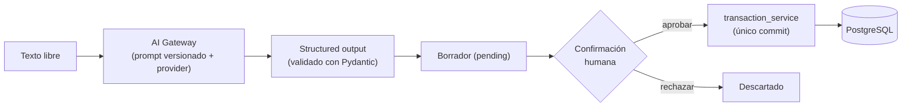

# Vector

No te dice solamente cuánto dinero tenés. Te dice cuánto podés usar.

Las apps de finanzas muestran el saldo de la cuenta y lo tratan como dinero disponible.
No lo es: ese número todavía incluye el alquiler que vence en diez días, las cuotas que se
van a debitar y los servicios del mes. Vector parte del saldo, resta todo lo que ya está
comprometido y responde una sola pregunta: **cuánto podés gastar hoy sin comprometer el
resto del mes.**

Es un proyecto personal, hecho para el contexto argentino (pesos, sueldo mensual, compras
en cuotas). Organiza y simula; no da asesoramiento financiero.

## Qué hace

- **Disponible real y límite diario.** Descuenta compromisos pendientes, dinero protegido
  y margen de seguridad, y reparte el resto entre los días que faltan hasta cobrar.
- **Registro en lenguaje natural.** Escribís `café 3500` o `super 42 mil` y la IA lo
  interpreta. Nada se guarda hasta que lo confirmás.
- **Simulación de compras en cuotas.** Antes de comprar, ver el impacto mes a mes, con y
  sin la compra, y comparado con empezar un mes más tarde.
- **Copiloto financiero.** Preguntas sobre tus propios datos ("¿qué pagos tengo antes de
  cobrar?"), respondidas con evidencia y sin que el modelo toque el dinero.
- **En qué se fue tu plata.** Cada gasto queda categorizado y el dashboard muestra el mes
  en curso por categoría, en una torta con montos y porcentajes.

## Cómo está construido

### Las categorías las resuelven reglas, no la IA

Un gasto pertenece siempre a una de estas diez categorías: `comida`, `transporte`,
`vivienda`, `servicios`, `salud`, `suscripciones`, `compras`, `ocio`, `educación`, `otros`.
Los ingresos conservan su categoría de texto libre.

`app/services/categorizer.py` es el único lugar donde se decide, y no llama a ningún
modelo: normaliza el texto (minúsculas, sin acentos) y busca palabras clave ("nafta" o
"combustible" → `transporte`, "supermercado" o "pedidosya" → `comida`). El orden es
siempre el mismo:

1. la categoría que eligió la persona, si está en la lista;
2. las reglas, sobre la categoría escrita, la descripción y el texto original;
3. `otros`, si nada coincide.

Vale para el alta manual, para "Escribilo con IA" y para el copiloto: los tres terminan en
`TransactionCreate`, que deja la categoría resuelta antes de guardar. El formulario propone
la categoría mientras se escribe la descripción y se puede cambiar siempre.

`GET /api/v1/dashboard/summary` agrega, además del disponible, la actividad del mes
calendario en curso: `month_income_total`, `month_expenses_total`, `month_savings`,
`previous_month_expenses_total` y `category_summary` (solo gastos, top 5 y el resto
agrupado en `otros`, de mayor a menor, con monto y porcentaje). El agrupamiento lo hace
PostgreSQL en una única consulta `GROUP BY`.

### El dinero no lo calcula la IA

El motor financiero (`app/services/financial_engine.py`) es puro y determinístico: no toca
la base, no depende de FastAPI, no usa `float` y acepta una fecha `as_of` para poder
probarlo con fechas fijas. Todo el dinero es `Decimal` en Python y `Numeric` en PostgreSQL,
y viaja como string en el JSON (`"620000.00"`) para no perder precisión en el camino.

```
horizonte           = próximo ingreso, o fin de mes si no hay fecha
available_real      = saldo − compromisos pendientes − protegido − colchón
daily_safe_to_spend = max(available_real, 0) ÷ días hasta cobrar   (ROUND_DOWN)
```

Trunca hacia abajo a propósito. Si falta la fecha del próximo ingreso no inventa un número:
devuelve `null` y la interfaz lo dice. Un compromiso vencido pero impago sigue contando
como dinero comprometido.

En la simulación de cuotas, el residuo de la división se ajusta en la última cuota para que
la suma dé exactamente el total. No calcula intereses ni CFT: se ingresa el monto final
financiado. La conclusión es neutral (`fits_within_reserves` / `breaks_reserves` /
`insufficient_data`).

### El modelo propone, la persona dispone

La capa de IA nunca escribe dinero por su cuenta. El flujo es siempre
`interpretar → borrador → confirmación humana → escritura`:



Las piezas:

- **Gateway desacoplado** (`app/ai/gateway.py`): elige el proveedor por configuración,
  carga el prompt versionado con checksum y valida la salida contra el schema de dominio.
  Depende de la interfaz `AIProvider`, no del SDK. Hay un proveedor `mock` determinístico,
  así que todo el proyecto corre sin API key y sin costo.
- **Confirmación atómica**: `claim_for_confirmation` reclama el borrador con un UPDATE
  condicional. Dos confirmaciones simultáneas crean un solo movimiento; la segunda recibe
  409. Si PostgreSQL falla, el borrador vuelve a `pending`.
- **Copiloto con LangGraph** (`app/ai/agent/`): grafo `classify_intent → plan_tools →
  execute_tools → generate_answer → verify_results → [apply_write]`. Las escrituras pausan
  el grafo con `interrupt_before` hasta la aprobación; el checkpointer en PostgreSQL
  sostiene la conversación multi-turno.
- **Tools acotadas**: lectura (resumen financiero, compromisos pendientes, totales por
  período y categoría, búsqueda de movimientos, preview de simulación) y escritura solo vía
  borrador. Ninguna tool declara `user_id` en su schema: el dueño sale del JWT y viaja por
  el contexto de ejecución, fuera del estado del grafo y fuera del prompt.
- **RAG híbrido** (`app/ai/rag/`): full-text de PostgreSQL (`tsvector`/`ts_rank`) y
  pgvector fusionados con Reciprocal Rank Fusion, aislados por usuario. El RAG solo
  *encuentra* movimientos; las sumas las hace SQL (`spending_service`).
- **Verificador determinístico**: rechaza montos sin evidencia y escrituras sin aprobación
  antes de que la respuesta llegue a la pantalla.
- **Trazas** en JSON con intención, tools, duraciones y resultado del verificador. No se
  loguea texto del usuario, montos, prompts ni respuestas crudas salvo que se active
  `AI_LOG_CONTENT` a mano.

El texto del usuario se trata como dato, no como instrucción. Hay un evaluador de prompt
injection que corre en cada iteración.

### No toda pregunta termina en una consulta

Un copiloto financiero que solo sabe contestar con SQL es un buscador con otra cara. Cada
turno declara su **ruta** (`app/ai/agent/schemas.py`) y de ahí sale todo lo demás:

| Ruta | Cuándo | Quién pone los números |
|---|---|---|
| `deterministic` | "¿cuánto gasté este mes?", "¿cuánto tengo disponible?" | SQL y el motor financiero |
| `simulation` | "¿puedo comprarla en 9 cuotas?" | el simulador determinístico |
| `action` | "gasté 10.000 en nafta" | borrador + aprobación humana |
| `clarification` | falta el precio, la fecha o el monto | nadie: se pregunta |
| `conversational` | "¿qué es un fondo de emergencia?" | nadie: se explica |
| `mixed` | "¿estoy gastando demasiado en comida?" | SQL primero, razonamiento después |
| `unsupported` / `error` | fuera de alcance, o algo falló de verdad | — |

Las tres reglas que sostienen esto:

1. **Que falte un dato no es un error.** Es un estado (`pending_request`): se guarda lo que
   ya se sabe, se pregunta lo que falta y el turno siguiente completa. "¿Puedo comprar una
   notebook en 9 cuotas?" pregunta el precio; "1.200.000" ejecuta la simulación.
2. **Se consulta la base solo si la respuesta depende de la plata de quien pregunta.** "¿Qué
   es un gasto fijo?" no toca PostgreSQL; "¿cuánto gasto yo en fijos?" sí.
3. **Conversar no habilita a inventar.** En la ruta conversacional no corre ninguna tool, y
   por lo tanto ningún monto tiene respaldo: el verificador no deja pasar ni uno. Los
   números salen siempre de los datos, nunca del modelo.

El verificador es por ruta, y cuando algo no pasa **no se corta la conversación**: en un
turno de datos se cae a la plantilla determinística —que tiene los números correctos— y en
uno conversacional se ofrece mirar los datos reales. El mensaje de error quedó para lo que
de verdad falla: el proveedor caído, una salida estructurada corrupta, una tool rota.

### Autenticación

Vector no emite ni guarda credenciales. Registro, login, hash de contraseña y renovación de
token ocurren en Supabase Auth; el backend solo verifica el token que llega. No hay tabla
de usuarios propia ni contraseñas en la base.

`app/core/security.py` valida la firma contra el JWKS público del proyecto, más `exp`,
`iss`, `aud` y que `sub` sea un UUID. Nunca se decodifica un token sin verificar la firma,
y la identidad jamás sale de un `user_id` que venga por query, body o header. El JWKS se
cachea en memoria y se refresca solo ante un `kid` desconocido, así que una rotación de
claves se resuelve sin reiniciar.

Toda la aplicación es multiusuario: perfil, movimientos, compromisos, simulaciones,
borradores, conversaciones, RAG y checkpoints resuelven el usuario desde el token. Un id de
otra cuenta responde 404, igual que uno inexistente: el filtro por dueño va en la misma
consulta que busca por id.

## Stack

| Capa | Tecnología |
|---|---|
| Backend | Python 3.12, FastAPI, Pydantic 2 |
| Base de datos | PostgreSQL 17 + pgvector, SQLAlchemy 2, Alembic |
| IA | OpenAI (Responses API), LangGraph, pgvector |
| Auth | Supabase Auth (JWT verificado con JWKS) |
| Frontend | React 19, Vite, CSS propio |
| Tests | Pytest, Vitest + Testing Library |
| Local | Docker Compose (solo PostgreSQL) |

## Puesta en marcha

Necesitás Python 3.12, Node 20+ y Docker Desktop corriendo. Los comandos son para
PowerShell en Windows.

### Backend

```powershell
cd backend
py -3.12 -m venv .venv
.\.venv\Scripts\Activate.ps1
python -m pip install -r requirements-dev.txt
Copy-Item .env.example .env
```

En `.env`, poné tu propia `POSTGRES_PASSWORD` y hacé que coincida con la que está dentro de
`DATABASE_URL`: el contenedor crea el usuario con la primera y el backend se conecta con la
segunda.

Levantá PostgreSQL desde la raíz del repo y esperá a que figure `healthy`:

```powershell
cd ..
docker compose up -d db
docker compose ps
```

> `docker compose down -v` borra el volumen con todos los datos locales. Es irreversible.

Las tablas las crea Alembic, no la aplicación: FastAPI nunca ejecuta migraciones al
arrancar.

```powershell
cd backend
python -m alembic upgrade head
python -m app.scripts.seed_demo
python -m uvicorn app.main:app --reload --port 8000
```

El seed es idempotente (UUID fijos, solo inserta lo que falta) y no recalcula el saldo. Es
una herramienta de demo: no lo corras en producción.

Queda en http://127.0.0.1:8000, con Swagger en `/docs`. Hay dos healthchecks a propósito:
`/health` responde 200 mientras la API esté viva aunque PostgreSQL esté apagado, y
`/health/db` ejecuta un `SELECT 1` y responde 503 si la base no contesta.

### Frontend

En otra terminal:

```powershell
cd frontend
npm install
Copy-Item .env.example .env.local
npm run dev
```

`VITE_SUPABASE_URL` y `VITE_SUPABASE_PUBLISHABLE_KEY` son las credenciales públicas del
proyecto de Supabase (Project Settings > API). Sin ellas la aplicación no arranca y dice
qué falta. Al frontend solo entra la publishable key; la secret key y la service_role key
nunca.

Queda en http://localhost:5173, que es el origen que el backend habilita en CORS. Sin
backend igual renderiza: muestra el estado de API desconectada con un botón para
reintentar.

## API

Todos los endpoints cuelgan de `/api/v1` y exigen sesión. Sin token responden 401, antes de
llamar al modelo en el caso de los de IA.

| Método | Ruta | Qué hace |
|---|---|---|
| GET | `/auth/me` | Identidad del token verificado. |
| GET · PUT | `/profile` | Perfil financiero. El `GET` responde 404 hasta el onboarding. |
| GET · POST · PATCH · DELETE | `/transactions` | Movimientos. Ajustan el saldo. |
| GET · POST · PATCH · DELETE | `/commitments` | Compromisos. No tocan el saldo. |
| GET | `/dashboard/summary` | Disponible, diario, proyección de fin de mes y gasto del mes por categoría. |
| POST | `/simulations/purchase` | Simula una compra en cuotas y la persiste. |
| GET | `/simulations` | Las 10 simulaciones más recientes. |
| POST | `/ai/transactions/parse` | Interpreta texto y devuelve un borrador. No persiste. |
| POST | `/ai/transactions/{id}/confirm` · `/reject` | Confirma o descarta el borrador. |
| POST | `/ai/chat` | Copiloto. |
| GET | `/ai/conversations/{id}` | Historial. |
| POST | `/ai/conversations/{id}/approve` · `/reject` | Reanuda el grafo desde el checkpoint. |
| GET | `/ai/usage` | Cuota diaria de IA restante. |

El perfil *es* el usuario: su clave primaria es el UUID de Supabase, y la fila la crea el
primer `PUT`.

Sobre el saldo: crear un ingreso lo sube, crear un gasto lo baja, editar revierte el efecto
anterior y aplica el nuevo, borrar revierte. Todo en un único commit, con el perfil
bloqueado con `SELECT ... FOR UPDATE`. Los compromisos, en cambio, nunca modifican el
saldo: marcarlos como pagados es solo un cambio de estado.

## Aislamiento entre cuentas

El aislamiento se sostiene en **dos barreras independientes**, y cada una cubre un camino
distinto:

**1. El backend (repositorio).** El `user_id` sale exclusivamente del `sub` de un JWT con la
firma verificada contra el JWKS de Supabase. El cliente no lo manda nunca: no se acepta por
body, ni por query, ni por header, y ninguna tool del copiloto lo declara en su schema. Cada
consulta lleva el filtro por dueño en la MISMA sentencia que el id, así que un recurso ajeno
responde 404 igual que uno inexistente y no se puede averiguar si existe. En el copiloto, el
hilo del checkpointer es `<user_id>:<conversation_id>`: un `conversation_id` ajeno resuelve
un hilo vacío.

**2. Row Level Security (PostgreSQL).** Protege el camino que NO pasa por el backend. Si la
base es la de Supabase, PostgREST publica el schema `public` y la publishable key viaja en el
bundle del frontend: sin RLS, cualquiera pide las tablas y se lleva los datos de todos. Las
políticas comparan contra `auth.uid()`, con `USING` y `WITH CHECK`.

Las dos barreras hacen falta y ninguna reemplaza a la otra. El backend **no** está sujeto a
RLS —se conecta con el rol dueño de las tablas, y no se usa `FORCE ROW LEVEL SECURITY`— y eso
es deliberado: forzarlo lo dejaría sin ver una sola fila, porque nunca define
`request.jwt.claims`.

Qué puede hacer un cliente directo, por tabla:

| Tabla | SELECT | INSERT / UPDATE / DELETE |
| --- | --- | --- |
| `user_profiles`, `transactions`, `commitments`, `purchase_simulations` | lo propio | lo propio |
| `ai_drafts`, `ai_daily_usage`, `transaction_search_documents` | lo propio | **nadie** |
| `rate_limit_counters` | nadie | nadie |
| `checkpoints`, `checkpoint_blobs`, `checkpoint_writes` | lo propio (por `thread_id`) | nadie |
| `checkpoint_migrations` | nadie | nadie |

Las tres del medio son de solo lectura a propósito: una política de escritura sobre
`ai_daily_usage` dejaría poner `used = 0` y darse cuota infinita de IA, y una sobre
`ai_drafts` permitiría saltarse la confirmación atómica de un borrador.

Las tablas del checkpointer las crea LangGraph en tiempo de ejecución, no Alembic. La
migración deja una función idempotente, `public.plata_secure_langgraph_tables()`, que el
backend vuelve a llamar después de `saver.setup()`; también se puede correr a mano.

## Estado del copiloto (checkpointer)

El estado conversacional —el historial multi-turn y, sobre todo, la **acción pendiente de
aprobación**— vive en PostgreSQL, no en memoria. Si se perdiera, alguien que pidió registrar
un gasto y no llegó a aprobarlo se quedaría con una acción imposible de resolver. En Render
el proceso se reinicia y se duerme, y puede haber más de una instancia.

Lo administra `app/ai/agent/checkpointer.py`:

- **Un pool de conexiones** (`psycopg_pool`, ya venía como dependencia de
  `langgraph-checkpoint-postgres`), no una conexión única. `PostgresSaver` acepta el pool y
  saca una conexión por operación: las peticiones concurrentes no se serializan y, si una
  conexión muere, el pool la reemplaza sola. No se abre una conexión por mensaje.
- **Se inicializa en el arranque** (lifespan), no en la primera petición, así el DDL de
  `setup()` y la aplicación de RLS no caen en medio del primer mensaje de alguien.
- **`setup()` va detrás de un advisory lock.** `checkpoint_migrations.v` es `PRIMARY KEY` y
  `setup()` lee-y-después-inserta, así que dos instancias arrancando a la vez contra una
  base nueva aplicarían la misma migración y una moriría con clave duplicada.
- **El pool se cierra en el shutdown.**

Si PostgreSQL no está disponible, **la aplicación arranca igual** y solo el copiloto queda
en 503 con un mensaje que dice que las funciones manuales siguen andando. Tumbar Vector
entera porque el copiloto no puede checkpointear sería peor: el dashboard, los movimientos,
los compromisos y las simulaciones no dependen de esto. Lo que **nunca** pasa es caer a
memoria en silencio.

`AI_CHECKPOINT_STORE` acepta exactamente dos valores y se valida al arrancar: `postgres`
(por defecto, el único válido en producción) y `memory` (opt-in, solo para tests y
desarrollo sin base). Un valor desconocido corta el arranque con un mensaje que dice cuáles
son los permitidos; antes, cualquier cosa que no fuera `memory` caía en postgres y un typo
funcionaba de casualidad.

**Retención:** las tablas del checkpointer crecen con el uso y hoy **no se limpian nunca**.
Es deliberado: borrar conversaciones viejas automáticamente podría llevarse una acción
pendiente sin resolver. Antes de que el volumen moleste hay que definir una política de
retención (por antigüedad del checkpoint, conservando los hilos con pausa activa) y recién
ahí sumar el job.

Todo esto tiene tests: `test_multiuser_isolation.py` y `test_ai_multiuser_isolation.py` para
el backend, `test_rls_policies.py` para las políticas (hablando con PostgreSQL como lo haría
PostgREST) y `test_endpoint_security_contract.py`, que barre la superficie HTTP y falla si
aparece un endpoint sin sesión.

## Rate limiting

Acota **cuántas peticiones** entran, que es un problema distinto de cuánta IA se gasta. Los
contadores viven en PostgreSQL (`rate_limit_counters`) y no en memoria: en Render el proceso
se reinicia y puede haber más de una instancia, así que un contador en memoria se perdería y
cada instancia contaría por su lado. Se usa la misma técnica atómica que la cuota diaria
(`INSERT ... ON CONFLICT DO UPDATE ... WHERE count < limite`), así que no hace falta Redis.

Hay límites por IP (toda la API, `/auth` y las operaciones de IA) y por cuenta autenticada
(IA y escrituras). Las IP nunca se guardan en claro: se hashean con HMAC-SHA256 usando
`RATE_LIMIT_IP_HASH_SECRET`, y las ventanas vencidas se borran solas.

Al pasarse, la respuesta es 429 con `Retry-After` y `detail.code = "rate_limit_exceeded"`,
distinto del `daily_ai_limit_reached` de la cuota: uno se resuelve esperando unos segundos y
el otro recién mañana, y el frontend muestra el mensaje que corresponde.

El registro y el login **no** pasan por este backend —los atiende Supabase Auth—, así que sus
límites se configuran en el panel de Supabase.

## Límite diario de consultas inteligentes

Cada llamada al modelo cuesta plata, así que hay **una** cuota diaria por cuenta —10 por
defecto, configurable con `AI_DAILY_LIMIT`— compartida por todos los canales de IA: el
copiloto, la interpretación de movimientos y, cuando exista, WhatsApp. Un canal nuevo
consume del mismo contador con solo pasar el UUID del usuario autenticado a
`ai_usage_service.daily_quota`.

Al agotarla, la API responde 429 con un mensaje ya pensado para el usuario; el resto de la
aplicación (el formulario manual, el dashboard, los compromisos, las simulaciones) no tiene
límite porque no cuesta nada.

Reservar un uso es una sola sentencia:

```sql
INSERT ... VALUES (..., 1)
ON CONFLICT (user_id, usage_day, kind)
DO UPDATE SET used = ai_daily_usage.used + 1
WHERE ai_daily_usage.used < :limite
RETURNING used
```

Si el `WHERE` no se cumple, PostgreSQL no devuelve fila: eso *es* el límite alcanzado. Sin
lectura previa no existe la ventana entre consultar y reservar por la que se colarían las
llamadas concurrentes, y como PostgreSQL serializa la fila, varias instancias del backend
comparten el contador sin coordinarse. El día corta a las 00:00 de Argentina
(`AI_USAGE_TIMEZONE`), no en UTC.

La columna `kind` es herencia del diseño anterior, que tenía una cuota por operación: hoy
guarda siempre el mismo valor, así que la clave lógica es (usuario, día) y no puede haber
dos registros de la misma cuenta para la misma fecha.

Solo se cobra lo que llega al proveedor. Un 422, un 409 por acción pendiente, confirmar un
borrador o consultar la cuota no gastan nada; un 503 devuelve la reserva. Un 502 por
respuesta inválida del modelo sí gasta, porque la llamada ya se facturó.

La cuota restante vuelve en un campo `usage` de la respuesta (`limit`, `used`, `remaining`,
`reset_at`/`resets_at`, `timezone`) y en cabeceras `X-AI-Daily-*`, que es el único lugar
donde puede viajar en el 429. Desde 3 usos restantes la interfaz avisa sin interrumpir. El
frontend nunca calcula la cuota por su cuenta.

## Arranque del backend (Render, plan gratuito)

Con el servicio dormido, la primera petición tarda cerca de un minuto. Antes eso se veía
como "No pudimos conectar con el servidor", que describe mal lo que pasa.

`BackendStatusProvider` sondea `/health` al abrir la aplicación —mientras la persona todavía
está en el login, así Render va despertando— y `BackendGate` no monta el dashboard hasta que
responda: nunca salen las cinco consultas iniciales contra un servidor que está arrancando.
Un timeout, una red caída o un 502/503/504 se reintentan con espera creciente durante unos
75 segundos, mostrando el estado y un botón de reintento; cuando `/health` responde 200 la
información se carga sola, sin recargar la página.

Lo que **no** pasa por ahí: un 401 es sesión vencida y lo resuelve el flujo de siempre, un
429 muestra el límite diario y un 500 conserva su error genérico.

## Despliegue

FastAPI **no** ejecuta migraciones al arrancar, ni en desarrollo ni en producción. Render
publica el código nuevo apenas se hace push, así que la migración va **antes** que el
deploy: si sale después, queda una ventana con código nuevo sobre un esquema viejo y cada
endpoint que use una columna nueva responde 500.

Orden, con `DATABASE_URL` apuntando a la base de Supabase de producción:

```powershell
cd backend
python -m alembic current    # dónde está la base
python -m alembic heads      # dónde está el repo: tiene que haber una sola head
python -m alembic upgrade head
```

Recién entonces se despliega el backend, y al final el frontend. Las migraciones de Vector
son aditivas (columnas nuevas con default), así que el código viejo sigue funcionando
contra el esquema nuevo mientras dura el deploy.

`tests/test_alembic_migrations.py` verifica lo mismo contra la base a la que apunte
`DATABASE_URL`: que haya una sola head, que la base esté en esa head y que el esquema
coincida con los modelos.

## Tests y calidad

```powershell
# backend
python -m pytest
python -m ruff check .
python -m ruff format --check .
python -m alembic check

# frontend
npm run lint
npm run test
npm run build
```

Los tests del backend se dividen en unitarios (motor financiero, schemas, health, JWT) y de
integración. Los de integración corren contra el PostgreSQL de desarrollo pero de forma
transaccional: cada test abre una transacción externa y crea la sesión con
`join_transaction_mode="create_savepoint"`, así los endpoints hacen commit con normalidad y
al terminar se revierte todo. Los datos demo nunca se alteran. Si la base no está
disponible, se saltan con un mensaje claro en vez de marcarse como pasados.

Los del frontend usan Vitest sobre jsdom con la capa de API mockeada, así que no necesitan
backend ni PostgreSQL.

### Evaluadores

Corren con el proveedor mock, sin costo, y salen con código distinto de cero si una métrica
clave cae:

```powershell
python -m app.ai.evaluators.transaction_parser   # intención, tipo, monto, fecha, schema
python -m app.ai.evaluators.intent_routing
python -m app.ai.evaluators.tool_selection
python -m app.ai.evaluators.prompt_injection
python -m app.ai.evaluators.hybrid_retrieval     # precisión, recall, MRR, aislamiento
python -m app.ai.evaluators.grounded_answers
```

Los datasets están versionados en `backend/evals/*.jsonl`.

### Validación con el proveedor real

Los tests y los evaluadores nunca hacen llamadas pagas. Para verificar la integración real
hay un smoke aparte, protegido por variable de entorno:

```powershell
$env:RUN_REAL_AI_TESTS="1"
python -m app.scripts.real_ai_smoke
```

Corta en `REAL_AI_MAX_CALLS` (12 por defecto), no imprime secretos y limpia en un `finally`
todo lo que crea.

## Configuración

Los valores reales viven en `backend/.env` y `frontend/.env.local`, ambos ignorados por
Git. Las variables están documentadas en los dos `.env.example`. Las más relevantes:

| Variable | Por defecto | Para qué |
|---|---|---|
| `AI_PROVIDER` | `mock` | `mock` u `openai`. Con `mock` todo funciona sin API key. |
| `AI_API_KEY` | vacía | Solo con proveedor real. Nunca se loguea ni se devuelve. |
| `AI_EMBEDDING_PROVIDER` | `mock` | Embeddings del RAG. |
| `AI_DRAFT_STORE` | `postgres` | `memory` para desarrollo sin base. |
| `AI_CHECKPOINT_STORE` | `postgres` | Estado del copiloto. Solo `postgres` o `memory`; otro valor no arranca. `memory` pierde las conversaciones y las aprobaciones pendientes al reiniciar: nunca en producción. |
| `AI_DAILY_LIMIT` | `10` | Consultas inteligentes por cuenta y por día, para toda la IA. |
| `AI_USAGE_TIMEZONE` | `America/Argentina/Buenos_Aires` | Zona del corte diario del contador. |
| `AI_LOG_CONTENT` | `false` | Loguear contenido. Solo para depuración local. |
| `SUPABASE_JWKS_URL` · `_ISSUER` · `_AUDIENCE` | — | Verificación del token. No son secretos. |
| `RATE_LIMIT_ENABLED` | `true` | Interruptor general del rate limiting. |
| `RATE_LIMIT_IP_HASH_SECRET` | vacía | **Secreto.** Clave para hashear la IP. Definirla en producción. |
| `RATE_LIMIT_IP_PER_MINUTE` | `120` | Techo general por IP sobre toda la API. |
| `RATE_LIMIT_AUTH_IP_PER_MINUTE` | `30` | Techo por IP en `/auth`. |
| `RATE_LIMIT_AI_USER_PER_MINUTE` | `10` | Peticiones de IA por cuenta y por minuto. |
| `RATE_LIMIT_AI_IP_PER_HOUR` | `60` | Peticiones de IA por IP y por hora. |
| `RATE_LIMIT_WRITE_USER_PER_MINUTE` | `60` | Escrituras del dominio por cuenta y por minuto. |
| `RATE_LIMIT_TRUST_FORWARDED_FOR` | `true` | Leer la IP de `X-Forwarded-For`. En Render hace falta. |
| `RATE_LIMIT_FORWARDED_DEPTH` | `1` | Cuántos proxies hay delante. |

Si `AI_PROVIDER=openai` apunta a un modelo `mock-*`, el backend rechaza la configuración.

## Estado y limitaciones

El MVP está completo y validado contra OpenAI real. Lo que todavía no está:

- CAPTCHA y verificación de mail en el registro. Ya hay rate limiting por IP y por cuenta,
  pero crear cuentas sigue siendo gratis: el registro lo atiende Supabase Auth, así que esos
  límites se configuran en su panel y no en este backend.
- Login con Google, recuperación de contraseña y eliminación de cuenta.
- Índice ANN para pgvector: la búsqueda vectorial es exacta, suficiente para este volumen.
- La extracción de compromisos desde el chat es por reglas, no por modelo: entiende nombres
  libres ("netflix", "la factura de luz"), montos con o sin unidad coloquial y fechas
  relativas ("mañana", "el mes que viene", "en 10 días", "el viernes"), pero ante un dato
  que no encuentra lo pregunta en vez de inventarlo. Una frase muy retorcida puede quedar
  sin entender y termina en una repregunta.

Fuera de alcance por decisión, no por tiempo: voz, imágenes, OCR, PDFs, extractos
bancarios, múltiples monedas y finanzas compartidas.

## Sobre el nombre

Vector fue desarrollado inicialmente bajo el nombre interno Plata. Quedan identificadores
técnicos con ese nombre que **no** se renombraron porque están persistidos y renombrarlos no
aporta nada visible: la función SQL `plata_secure_langgraph_tables()`, las políticas RLS
`plata_<tabla>_<operación>`, el nombre de la base y el rol de PostgreSQL, y el volumen y el
contenedor de Docker Compose. Cambiarlos exigiría una migración con período de
compatibilidad; están anotados como deuda técnica y el usuario final no los ve.

La palabra "plata" en minúscula, cuando significa dinero ("en qué se fue tu plata"), es
lenguaje natural rioplatense y se conserva a propósito.

## Licencia

MIT. Ver [LICENSE](LICENSE).
