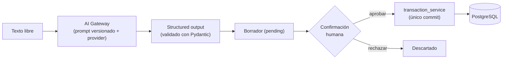

# Plata

No te dice solamente cuánto dinero tenés. Te dice cuánto podés usar.

Las apps de finanzas muestran el saldo de la cuenta y lo tratan como dinero disponible.
No lo es: ese número todavía incluye el alquiler que vence en diez días, las cuotas que se
van a debitar y los servicios del mes. Plata parte del saldo, resta todo lo que ya está
comprometido y responde una sola pregunta: **cuánto podés gastar hoy sin comprometer el
resto del mes.**

Es un proyecto personal, hecho para el contexto argentino (pesos, sueldo mensual, compras
en cuotas). Organiza y simula; no da asesoramiento financiero.

## Qué hace

- **Disponible real y límite diario.** Descuenta compromisos pendientes, dinero protegido
  y margen de seguridad, y reparte el resto entre los días que faltan hasta cobrar.
- **Registro en lenguaje natural.** Escribís `café 3500` o `super 42 mil` y la IA lo
  interpreta. Nada se guarda hasta que lo confirmás.
- **Simulación de compras en cuotas.** Antes de comprar, ver el impacto mes a mes, con y
  sin la compra, y comparado con empezar un mes más tarde.
- **Copiloto financiero.** Preguntas sobre tus propios datos ("¿qué pagos tengo antes de
  cobrar?"), respondidas con evidencia y sin que el modelo toque el dinero.

## Cómo está construido

### El dinero no lo calcula la IA

El motor financiero (`app/services/financial_engine.py`) es puro y determinístico: no toca
la base, no depende de FastAPI, no usa `float` y acepta una fecha `as_of` para poder
probarlo con fechas fijas. Todo el dinero es `Decimal` en Python y `Numeric` en PostgreSQL,
y viaja como string en el JSON (`"620000.00"`) para no perder precisión en el camino.

```
horizonte           = próximo ingreso, o fin de mes si no hay fecha
available_real      = saldo − compromisos pendientes − protegido − colchón
daily_safe_to_spend = max(available_real, 0) ÷ días hasta cobrar   (ROUND_DOWN)
```

Trunca hacia abajo a propósito. Si falta la fecha del próximo ingreso no inventa un número:
devuelve `null` y la interfaz lo dice. Un compromiso vencido pero impago sigue contando
como dinero comprometido.

En la simulación de cuotas, el residuo de la división se ajusta en la última cuota para que
la suma dé exactamente el total. No calcula intereses ni CFT: se ingresa el monto final
financiado. La conclusión es neutral (`fits_within_reserves` / `breaks_reserves` /
`insufficient_data`).

### El modelo propone, la persona dispone

La capa de IA nunca escribe dinero por su cuenta. El flujo es siempre
`interpretar → borrador → confirmación humana → escritura`:



Las piezas:

- **Gateway desacoplado** (`app/ai/gateway.py`): elige el proveedor por configuración,
  carga el prompt versionado con checksum y valida la salida contra el schema de dominio.
  Depende de la interfaz `AIProvider`, no del SDK. Hay un proveedor `mock` determinístico,
  así que todo el proyecto corre sin API key y sin costo.
- **Confirmación atómica**: `claim_for_confirmation` reclama el borrador con un UPDATE
  condicional. Dos confirmaciones simultáneas crean un solo movimiento; la segunda recibe
  409. Si PostgreSQL falla, el borrador vuelve a `pending`.
- **Copiloto con LangGraph** (`app/ai/agent/`): grafo `classify_intent → plan_tools →
  execute_tools → generate_answer → verify_results → [apply_write]`. Las escrituras pausan
  el grafo con `interrupt_before` hasta la aprobación; el checkpointer en PostgreSQL
  sostiene la conversación multi-turno.
- **Tools acotadas**: lectura (resumen financiero, compromisos pendientes, búsqueda de
  movimientos, preview de simulación) y escritura solo vía borrador. Ninguna tool declara
  `user_id` en su schema: el dueño sale del JWT y viaja por el contexto de ejecución, fuera
  del estado del grafo y fuera del prompt.
- **RAG híbrido** (`app/ai/rag/`): full-text de PostgreSQL (`tsvector`/`ts_rank`) y
  pgvector fusionados con Reciprocal Rank Fusion, aislados por usuario. El RAG solo
  *encuentra* movimientos; las sumas las hace SQL.
- **Verificador determinístico**: rechaza montos sin evidencia y escrituras sin aprobación
  antes de que la respuesta llegue a la pantalla.
- **Trazas** en JSON con intención, tools, duraciones y resultado del verificador. No se
  loguea texto del usuario, montos, prompts ni respuestas crudas salvo que se active
  `AI_LOG_CONTENT` a mano.

El texto del usuario se trata como dato, no como instrucción. Hay un evaluador de prompt
injection que corre en cada iteración.

### Autenticación

Plata no emite ni guarda credenciales. Registro, login, hash de contraseña y renovación de
token ocurren en Supabase Auth; el backend solo verifica el token que llega. No hay tabla
de usuarios propia ni contraseñas en la base.

`app/core/security.py` valida la firma contra el JWKS público del proyecto, más `exp`,
`iss`, `aud` y que `sub` sea un UUID. Nunca se decodifica un token sin verificar la firma,
y la identidad jamás sale de un `user_id` que venga por query, body o header. El JWKS se
cachea en memoria y se refresca solo ante un `kid` desconocido, así que una rotación de
claves se resuelve sin reiniciar.

Toda la aplicación es multiusuario: perfil, movimientos, compromisos, simulaciones,
borradores, conversaciones, RAG y checkpoints resuelven el usuario desde el token. Un id de
otra cuenta responde 404, igual que uno inexistente: el filtro por dueño va en la misma
consulta que busca por id.

## Stack

| Capa | Tecnología |
|---|---|
| Backend | Python 3.12, FastAPI, Pydantic 2 |
| Base de datos | PostgreSQL 17 + pgvector, SQLAlchemy 2, Alembic |
| IA | OpenAI (Responses API), LangGraph, pgvector |
| Auth | Supabase Auth (JWT verificado con JWKS) |
| Frontend | React 19, Vite, CSS propio |
| Tests | Pytest, Vitest + Testing Library |
| Local | Docker Compose (solo PostgreSQL) |

## Puesta en marcha

Necesitás Python 3.12, Node 20+ y Docker Desktop corriendo. Los comandos son para
PowerShell en Windows.

### Backend

```powershell
cd backend
py -3.12 -m venv .venv
.\.venv\Scripts\Activate.ps1
python -m pip install -r requirements-dev.txt
Copy-Item .env.example .env
```

En `.env`, poné tu propia `POSTGRES_PASSWORD` y hacé que coincida con la que está dentro de
`DATABASE_URL`: el contenedor crea el usuario con la primera y el backend se conecta con la
segunda.

Levantá PostgreSQL desde la raíz del repo y esperá a que figure `healthy`:

```powershell
cd ..
docker compose up -d db
docker compose ps
```

> `docker compose down -v` borra el volumen con todos los datos locales. Es irreversible.

Las tablas las crea Alembic, no la aplicación: FastAPI nunca ejecuta migraciones al
arrancar.

```powershell
cd backend
python -m alembic upgrade head
python -m app.scripts.seed_demo
python -m uvicorn app.main:app --reload --port 8000
```

El seed es idempotente (UUID fijos, solo inserta lo que falta) y no recalcula el saldo. Es
una herramienta de demo: no lo corras en producción.

Queda en http://127.0.0.1:8000, con Swagger en `/docs`. Hay dos healthchecks a propósito:
`/health` responde 200 mientras la API esté viva aunque PostgreSQL esté apagado, y
`/health/db` ejecuta un `SELECT 1` y responde 503 si la base no contesta.

### Frontend

En otra terminal:

```powershell
cd frontend
npm install
Copy-Item .env.example .env.local
npm run dev
```

`VITE_SUPABASE_URL` y `VITE_SUPABASE_PUBLISHABLE_KEY` son las credenciales públicas del
proyecto de Supabase (Project Settings > API). Sin ellas la aplicación no arranca y dice
qué falta. Al frontend solo entra la publishable key; la secret key y la service_role key
nunca.

Queda en http://localhost:5173, que es el origen que el backend habilita en CORS. Sin
backend igual renderiza: muestra el estado de API desconectada con un botón para
reintentar.

## API

Todos los endpoints cuelgan de `/api/v1` y exigen sesión. Sin token responden 401, antes de
llamar al modelo en el caso de los de IA.

| Método | Ruta | Qué hace |
|---|---|---|
| GET | `/auth/me` | Identidad del token verificado. |
| GET · PUT | `/profile` | Perfil financiero. El `GET` responde 404 hasta el onboarding. |
| GET · POST · PATCH · DELETE | `/transactions` | Movimientos. Ajustan el saldo. |
| GET · POST · PATCH · DELETE | `/commitments` | Compromisos. No tocan el saldo. |
| GET | `/dashboard/summary` | Disponible, diario y proyección de fin de mes. |
| POST | `/simulations/purchase` | Simula una compra en cuotas y la persiste. |
| GET | `/simulations` | Las 10 simulaciones más recientes. |
| POST | `/ai/transactions/parse` | Interpreta texto y devuelve un borrador. No persiste. |
| POST | `/ai/transactions/{id}/confirm` · `/reject` | Confirma o descarta el borrador. |
| POST | `/ai/chat` | Copiloto. |
| GET | `/ai/conversations/{id}` | Historial. |
| POST | `/ai/conversations/{id}/approve` · `/reject` | Reanuda el grafo desde el checkpoint. |
| GET | `/ai/usage` | Cuota diaria de IA restante. |

El perfil *es* el usuario: su clave primaria es el UUID de Supabase, y la fila la crea el
primer `PUT`.

Sobre el saldo: crear un ingreso lo sube, crear un gasto lo baja, editar revierte el efecto
anterior y aplica el nuevo, borrar revierte. Todo en un único commit, con el perfil
bloqueado con `SELECT ... FOR UPDATE`. Los compromisos, en cambio, nunca modifican el
saldo: marcarlos como pagados es solo un cambio de estado.

## Límites diarios de IA

Cada llamada al modelo cuesta plata, así que las dos operaciones que invocan al proveedor
tienen cuota diaria por cuenta: 20 consultas al copiloto y 10 interpretaciones. Al agotarla
responden 429 con un mensaje ya pensado para el usuario; el resto de la aplicación (el
formulario manual, el dashboard, los compromisos) no tiene límite porque no cuesta nada.

Reservar un uso es una sola sentencia:

```sql
INSERT ... VALUES (..., 1)
ON CONFLICT (user_id, usage_day, kind)
DO UPDATE SET used = ai_daily_usage.used + 1
WHERE ai_daily_usage.used < :limite
RETURNING used
```

Si el `WHERE` no se cumple, PostgreSQL no devuelve fila: eso *es* el límite alcanzado. Sin
lectura previa no existe la ventana entre consultar y reservar por la que se colarían las
llamadas concurrentes. El día corta a las 00:00 de Argentina, no en UTC.

Solo se cobra lo que llega al proveedor. Un 422, un 409 por acción pendiente, confirmar un
borrador o consultar la cuota no gastan nada; un 503 devuelve la reserva. Un 502 por
respuesta inválida del modelo sí gasta, porque la llamada ya se facturó.

La cuota restante vuelve en un campo `usage` de la respuesta y en cabeceras
(`X-AI-Daily-*`), que es el único lugar donde puede viajar en el 429. Desde 3 usos
restantes la interfaz avisa sin interrumpir. El frontend nunca calcula la cuota por su
cuenta.

## Tests y calidad

```powershell
# backend
python -m pytest
python -m ruff check .
python -m ruff format --check .
python -m alembic check

# frontend
npm run lint
npm run test
npm run build
```

Los tests del backend se dividen en unitarios (motor financiero, schemas, health, JWT) y de
integración. Los de integración corren contra el PostgreSQL de desarrollo pero de forma
transaccional: cada test abre una transacción externa y crea la sesión con
`join_transaction_mode="create_savepoint"`, así los endpoints hacen commit con normalidad y
al terminar se revierte todo. Los datos demo nunca se alteran. Si la base no está
disponible, se saltan con un mensaje claro en vez de marcarse como pasados.

Los del frontend usan Vitest sobre jsdom con la capa de API mockeada, así que no necesitan
backend ni PostgreSQL.

### Evaluadores

Corren con el proveedor mock, sin costo, y salen con código distinto de cero si una métrica
clave cae:

```powershell
python -m app.ai.evaluators.transaction_parser   # intención, tipo, monto, fecha, schema
python -m app.ai.evaluators.intent_routing
python -m app.ai.evaluators.tool_selection
python -m app.ai.evaluators.prompt_injection
python -m app.ai.evaluators.hybrid_retrieval     # precisión, recall, MRR, aislamiento
python -m app.ai.evaluators.grounded_answers
```

Los datasets están versionados en `backend/evals/*.jsonl`.

### Validación con el proveedor real

Los tests y los evaluadores nunca hacen llamadas pagas. Para verificar la integración real
hay un smoke aparte, protegido por variable de entorno:

```powershell
$env:RUN_REAL_AI_TESTS="1"
python -m app.scripts.real_ai_smoke
```

Corta en `REAL_AI_MAX_CALLS` (12 por defecto), no imprime secretos y limpia en un `finally`
todo lo que crea.

## Configuración

Los valores reales viven en `backend/.env` y `frontend/.env.local`, ambos ignorados por
Git. Las variables están documentadas en los dos `.env.example`. Las más relevantes:

| Variable | Por defecto | Para qué |
|---|---|---|
| `AI_PROVIDER` | `mock` | `mock` u `openai`. Con `mock` todo funciona sin API key. |
| `AI_API_KEY` | vacía | Solo con proveedor real. Nunca se loguea ni se devuelve. |
| `AI_EMBEDDING_PROVIDER` | `mock` | Embeddings del RAG. |
| `AI_DRAFT_STORE` · `AI_CHECKPOINT_STORE` | `postgres` | `memory` para desarrollo sin base. |
| `AI_DAILY_CHAT_LIMIT` · `AI_DAILY_PARSE_LIMIT` | `20` · `10` | Cuota diaria por cuenta. |
| `AI_LOG_CONTENT` | `false` | Loguear contenido. Solo para depuración local. |
| `SUPABASE_JWKS_URL` · `_ISSUER` · `_AUDIENCE` | — | Verificación del token. No son secretos. |

Si `AI_PROVIDER=openai` apunta a un modelo `mock-*`, el backend rechaza la configuración.

## Estado y limitaciones

El MVP está completo y validado contra OpenAI real. Lo que todavía no está:

- Rate limiting por IP. Los límites diarios son por cuenta, y crear cuentas es gratis, así
  que antes de exponer una demo pública hace falta eso más CAPTCHA y verificación de mail.
- Row Level Security en Supabase. El aislamiento hoy lo garantiza el backend.
- Login con Google, recuperación de contraseña y eliminación de cuenta.
- Índice ANN para pgvector: la búsqueda vectorial es exacta, suficiente para este volumen.
- La extracción de compromisos desde el chat cubre patrones simples y pregunta lo que falta
  en vez de inventarlo.

Fuera de alcance por decisión, no por tiempo: voz, imágenes, OCR, PDFs, extractos
bancarios, múltiples monedas y finanzas compartidas.

## Licencia

MIT. Ver [LICENSE](LICENSE).
